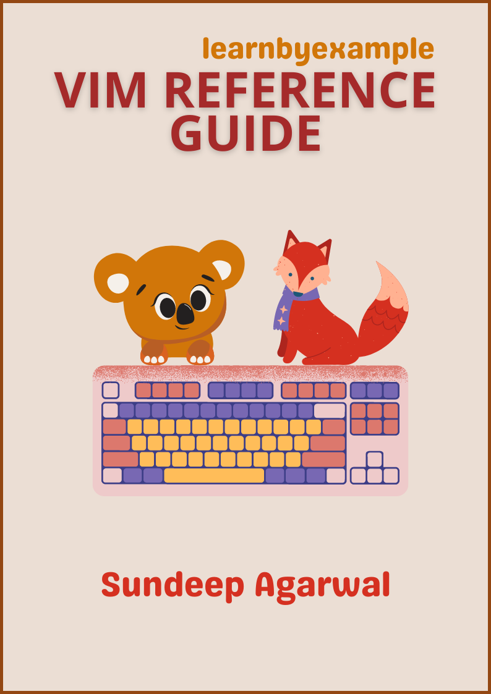

# Release offers

To celebrate this book's release, **Vim Reference Guide** is FREE to download till 31-Mar-2022. You can still pay if you wish ;)

* [Gumroad](https://learnbyexample.gumroad.com/l/vim_reference_guide)
* [Leanpub](https://leanpub.com/vim_reference_guide)

Three of my ebook bundles are on sale as well till 31-Mar-2022:

* [All books bundle](https://learnbyexample.gumroad.com/l/all-books/vim_release) is $8 (normal price $24)
    * all my 12 programming ebooks
* [Learn by example Python bundle](https://learnbyexample.gumroad.com/l/python-bundle/vim_release) is $3 (normal price $12)
    * Python intro, regex and projects
* [Magical one-liners bundle](https://learnbyexample.gumroad.com/l/oneliners/vim_release) is $3 (normal price $12)
    * grep, sed, awk, perl and ruby one-liners

 

# Vim Reference Guide

**Vim Reference Guide** is intended as a concise learning resource for beginner to intermediate level Vim users. It has more in common with cheatsheets than a typical text book. Topics like Regular Expressions and Macros have more detailed explanations and examples due to their complexity.

  

See [Version_changes.md](./Version_changes.md) to keep track of changes made to the book.

ℹ️ See also my [curated list on Vim](https://learnbyexample.github.io/curated_resources/vim.html) for beginner to advanced level learning resources.

 

# E-book

You can purchase the book using these links:

* https://learnbyexample.gumroad.com/l/vim_reference_guide
* https://leanpub.com/vim_reference_guide
* You can also get the book as part of **All books bundle** from https://learnbyexample.gumroad.com/l/all-books
* See https://learnbyexample.github.io/books/ for list of other books

For a preview of the book, see [sample chapters](https://github.com/learnbyexample/vim_reference/blob/master/sample_chapters/vim_reference_guide_sample.pdf)

The book can also be [viewed as a single markdown file in this repo](./vim_reference_guide.md). See my blogpost on [generating pdf/epub from markdown using pandoc](https://learnbyexample.github.io/customizing-pandoc/) if you are interested in the ebook creation process.

For web version of the book, visit https://learnbyexample.github.io/vim_reference/

 

# Feedback and Contributing

[Open an issue](https://github.com/learnbyexample/vim_reference/issues) if you spot any typo/errors.

⚠️ ⚠️ Please DO NOT submit pull requests. Main reason being any modification requires changes in multiple places.

I'd also highly appreciate your feedback about the book.

Twitter: https://twitter.com/learn_byexample

 

# Table of Contents

1) Preface
2) Introduction
3) Insert mode
4) Normal mode
5) Command-line mode
6) Visual mode
7) Regular Expressions
8) Macro
9) Customizing Vim
10) CLI options

 

# Acknowledgements

* [Vim help files](https://vimhelp.org/) — user and reference manuals
* [/r/vim/](https://www.reddit.com/r/vim) and [vi.stackexchange](https://vi.stackexchange.com/) — helpful forums
* [canva](https://www.canva.com/) — cover image
* [Warning](https://commons.wikimedia.org/wiki/File:Warning_icon.svg) and [Info](https://commons.wikimedia.org/wiki/File:Info_icon_002.svg) icons by [Amada44](https://commons.wikimedia.org/wiki/User:Amada44) under public domain
* [oxipng](https://github.com/shssoichiro/oxipng), [pngquant](https://pngquant.org/) and [svgcleaner](https://github.com/RazrFalcon/svgcleaner) for optimizing images
* [Rodrigo Girão Serrão](https://mathspp.com/) for feedback and suggestions
* [Andy](https://twitter.com/andylondon) for cover image suggestions
* [Inkscape](https://inkscape.org/) for favicon
* [mdBook](https://github.com/rust-lang/mdBook) — for web version of the book
    * [mdBook-pagetoc](https://github.com/JorelAli/mdBook-pagetoc) — for adding table of contents for each page
    * [minify-html](https://github.com/wilsonzlin/minify-html) — for minifying html files
    * [MDN: kbd](https://developer.mozilla.org/en-US/docs/Web/HTML/Element/kbd) — CSS for `<kbd>` tag

 

# License

The book is licensed under a [Creative Commons Attribution-NonCommercial-ShareAlike 4.0 International License](https://creativecommons.org/licenses/by-nc-sa/4.0/)

The code snippets are licensed under MIT, see [LICENSE](./LICENSE) file

